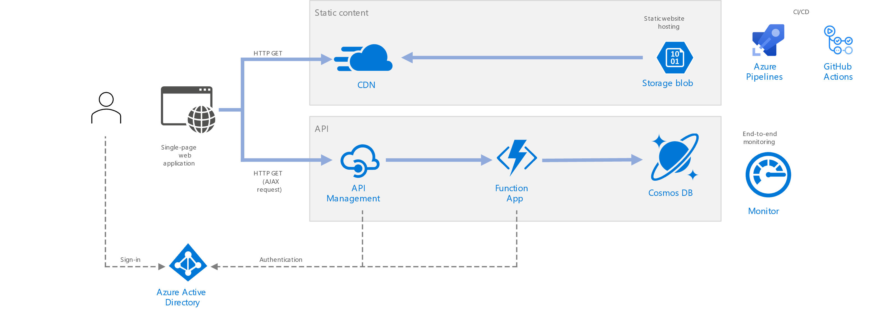

# Serverless web application

This sample references an architecture of a [serverless web application](https://docs.microsoft.com/en-us/azure/architecture/reference-architectures/serverless/web-app). The application serves static Angular.JS content from Azure Blob Storage (Static Website), and implements REST APIs for CRUD of a to do list with Azure Functions. The API reads data from Cosmos DB and returns the results to the web app. The GitHub workflow uses Azure Bicep for Infrastructure as Code to deploy and configure Azure resources.

## Security

The application uses MSAL.js (1.x) with Implicit flow to authenticate users. You can choose between Implicit flow and Authorization code flow for Single-page application (SPA) and API pattern. However, Authorization code flow is a recommended flow as it is more secure. The built-in authentication on Azure Functions is enabled for Authentication and authorization. In order for the authentication to work, the GitHub workflow uses AZ CLI to register the applications on Azure Active Directory and configure permissions between the SPA and API. Both Azure API Manager and Functions also implement CORS policy to allow only traffic from the client origin to access the API. Azure Functions has network access restriction is enabled to allow only traffic from API Management's IP address to make the request. To connect to Cosmos DB, Azure Functions uses Managed Identity to read connection strings stored in Azure Key Vault.

## Azure Functions HTTP Trigger and OpenAPI documents

On APIM, there are two approaches to import Azure Functions as API.

1. Azure backend integration.

    This is done through adding backend services of your Functions. This uses Functions' app key to access functions. The Bicep module [apimAPI.bicep](./deploy/modules/apimAPI.bicep) demonstrates how deploy this.

1. OpenAPI specification.

    By default, Azure Functions HTTP Trigger does not follow OpenAPI standard. [OpenAPI extension](https://github.com/Azure/azure-functions-openapi-extension/blob/main/docs/enable-open-api-endpoints-in-proc.md) is required to enable OpenAPI documents. The Bicep module [apimOpenAPI.bicep](./deploy/modules/apimOpenAPI.bicep) demonstrates how deploy this.

## Prerequisites

1. GitHub account and repository.
1. Azure subscription.
1. [User-assigned managed identity (MSI)](https://docs.microsoft.com/en-us/azure/active-directory/managed-identities-azure-resources/how-manage-user-assigned-managed-identities?pivots=identity-mi-methods-azp#create-a-user-assigned-managed-identity) with Contributor role. This will be used for executing Deployment Scripts in Bicep.
1. A Service Principal with Contributor role at subscription scope. This is the identity that will be used to access the Azure resources from GitHub Action. If you don't have a Service Principal, create one by following [these steps](https://docs.microsoft.com/en-us/azure/developer/github/connect-from-azure). The Service Principal also requires [Read/Write permissions to Azure Graph API](https://docs.microsoft.com/en-us/graph/api/application-post-applications?view=graph-rest-1.0&tabs=http#permissions).

## About sample workflows:

This repo contains three GitHub workflows:

* [Create Azure Resource (IaC)](.github/workflows/azure-infra-cicd.yml) workflow validates Bicep files and creates Azure resources necessary to host the sample solution. The Bicep file will create the following resources as a pre-requisite to the next two workflows:

    - Azure API Management.
    - Azure CDN.
    - Azure Cosmos DB for MongolDB.
    - Azure Functions (Windows).
    - Azure Key Vault option to BYO.
    - Azure Storage Account for hosting Static Website.

* [Build and publish .NET](.github/workflows/functions-api-cicd.yml) workflow build .NET Core application and publish it to Azure Function. It also import the HTTP Trigger Functions as API's to the API Management using Bicep. This requires that Functions must be able to generate an OpenAPI specification.

* [Build and publish Angular (SPA)](.github/workflows/spa-cicd.yml) workflow build Angular application and publish it to Azure Storage Account as a static website. This workflow will register both client and API applications in Azure Active Directory tenant of your subscription for authentication. It also purge Azure CDN to refresh static web content.

## Setup an end-to-end CI/CD workflows:

1. Fork this repo to your GitHub account.
1. Clone the copy repo to your local machine.
1. Edit [workflow](./.github/workflows/serverless-api.yml); modify parameter values.
1. Optional parameters in [Bicep file](./deploy/main.bicep) can be edited.
1. Commit changes will automatically trigger the workflow to deploy Azure resources and applications.

## References

* [Azure Bicep](https://docs.microsoft.com/en-us/azure/azure-resource-manager/bicep/overview)
* [Protect a web API backend in Azure API Management](https://docs.microsoft.com/en-us/azure/api-management/api-management-howto-protect-backend-with-aad)
* [Host a RESTful API with CORS in Azure App Service](https://docs.microsoft.com/en-us/azure/app-service/app-service-web-tutorial-rest-api)
* [Authentication and Authorization flow single-page application](https://docs.microsoft.com/en-us/azure/active-directory/develop/scenario-spa-overview)
* [Azure Functions and App Services built-in authentication](https://docs.microsoft.com/en-us/azure/app-service/overview-authentication-authorization)
* [API Management cross domain policies](https://docs.microsoft.com/en-us/azure/api-management/api-management-cross-domain-policies#AllowCrossDomainCalls)
* [Azure Functions and App Services network access restriction](https://docs.microsoft.com/en-us/azure/app-service/networking-features#access-restrictions)
* [Use Key Vault from App Service with Azure Managed Identity](https://docs.microsoft.com/en-us/samples/azure-samples/app-service-msi-keyvault-dotnet/keyvault-msi-appservice-sample/)

## License

See [LICENSE](./LICENSE.md).

## Contributing

This project has adopted the [Microsoft Open Source Code of Conduct](https://opensource.microsoft.com/codeofconduct/). For more information see the [Code of Conduct FAQ](https://opensource.microsoft.com/codeofconduct/faq/) or contact [opencode@microsoft.com](mailto:opencode@microsoft.com) with any additional questions or comments. More details on how to contribute see [contributing guide](./CONTRIBUTING.md).
